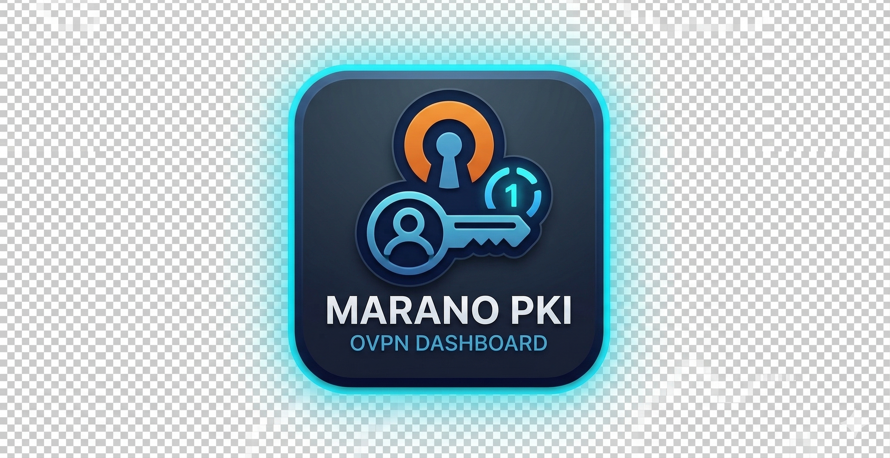
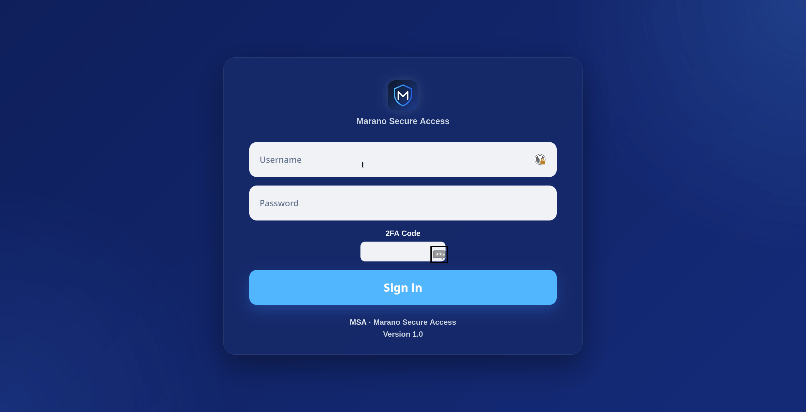
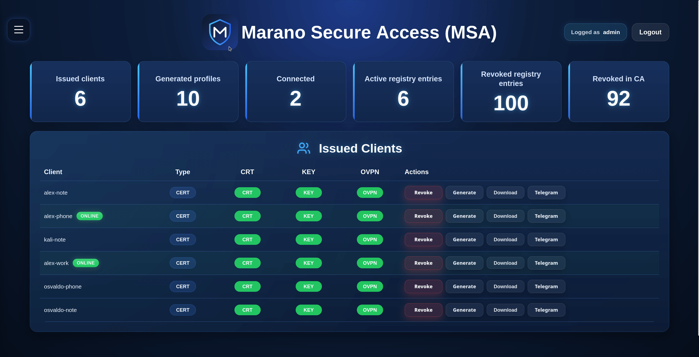
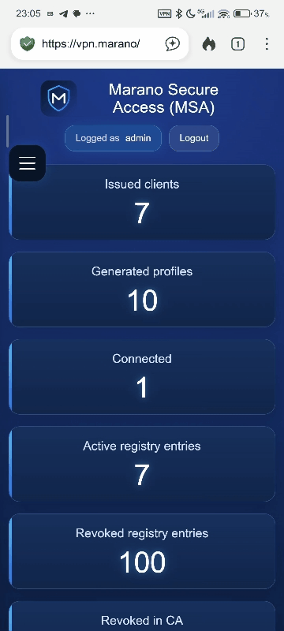
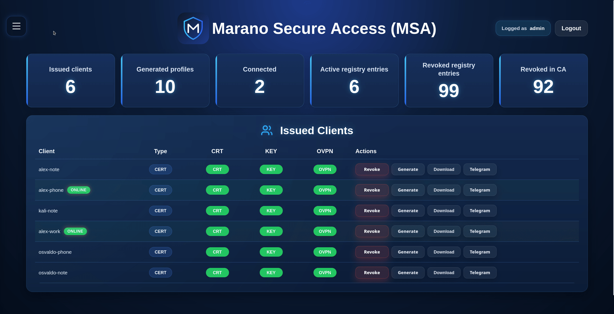
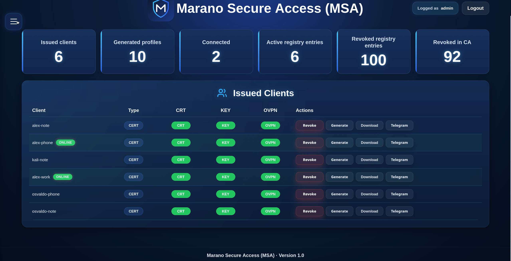
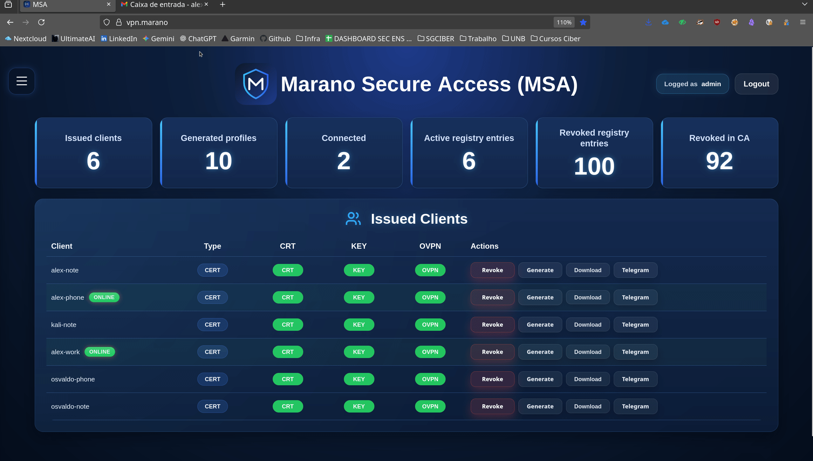
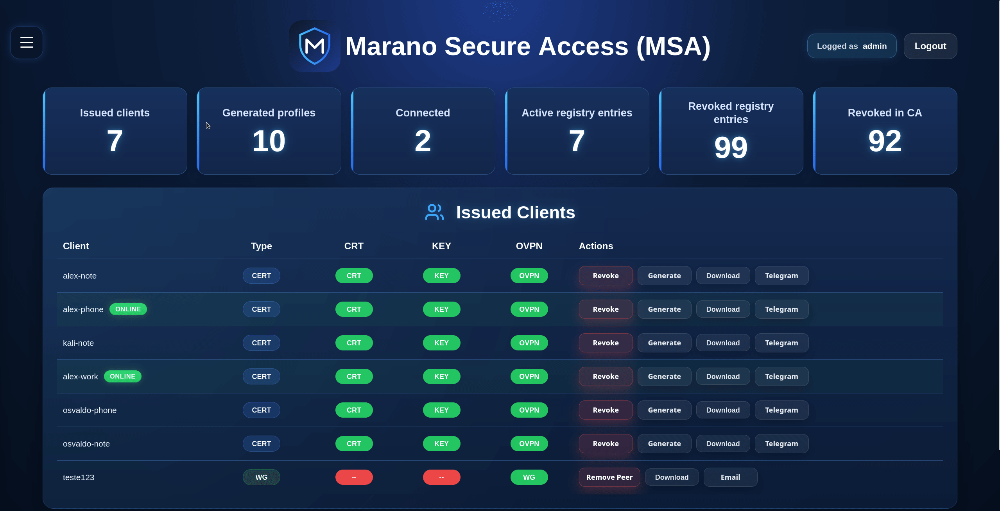
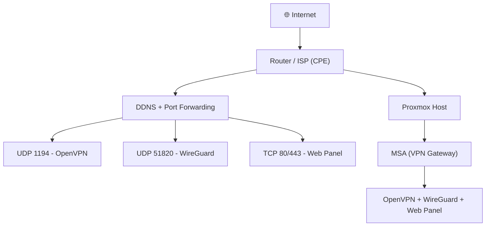

<div align="center">
  <h1>
    
    Marano Secure Access (MSA)
  </h1>
</div>

<p align="center">
  
</p>

<p align="center">
  <b>Self-hosted secure access platform with OpenVPN, WireGuard, MFA and full lifecycle control</b>
</p>

<div align="center">
  <h1>
   👊 No vendors. No limits. You in control!
  </h1>
</div>

## ⚡ Highlights

- 🔐 MFA (2FA) for administrative access  
- 🌐 OpenVPN + WireGuard support  
- 🧠 Registry-based lifecycle management  
- 📦 Profile delivery (Download / Email / Telegram)  
- ⚙️ Web automation  
- 🚫 No user limits  
- 🧩 Full PKI ownership  

---

## 🧠 What is MSA?

**Marano Secure Access (MSA)** is a **self-hosted secure access platform** designed to manage VPN access with full control over identity, lifecycle, and distribution.

It goes beyond a simple VPN installer by providing:

- identity-aware access  
- certificate lifecycle management  
- hybrid authentication (certificate + credentials)  
- centralized registry tracking  
- operational visibility  
- automation-ready workflows  

### 👉 Built for real-world environments such as homelabs, cyber training platforms, and internal infrastructure.


---

## 🎬 Features

### 🔐 MFA Login


### 🌐 Modern UI Webpage


## 📲 Mobile-friendly
<p align="center">
  
</p>

### 👤 Profile VPN creation


### ✅ Bulk VPN profile creation 


### 📨 Export to Telegram or email


### 🔁 Revoke / Remove Peer


---

## 🧱 Architecture

MSA is composed of four main layers:

### 🔹 Access Layer
- OpenVPN (Certificate / Auth)
- WireGuard

### 🔹 Identity Layer
- Email-based identity
- SQLite user database
- Unique email enforcement
- Password hashing (Werkzeug)

### 🔹 Access Control Layer
- MFA (admin)
- Token-based authentication (user portal)
- Session management

### 🔹 Management Layer
- Flask Web UI
- Registry engine (CSV)

### 🔹 Delivery Layer
- Email (mandatory)
- Telegram (optional)
- Direct download

---

## 🌍 Deployment (Real-world Example)

Typical home/lab setup:



## 🔐 Identity & Access Model

MSA enforces a **strict identity model**:

- 📧 One user = one email (unique)
- 🔐 Email is the primary identity
- 🔁 Self-service access recovery via secure tokens
- ⏳ Time-limited access links (one-time use)

This ensures:

- traceability
- secure onboarding
- controlled access recovery
- zero dependency on administrators

---

### 🔁 Self-Service Access Recovery

Users without credentials (e.g. certificate-only or WireGuard) can request access via temporary and single-use token

---

### 🚫 Security Design Decisions

- No email → ❌ no user creation
- No duplicate emails → ❌ blocked at DB level
- No token reuse → ❌ prevented
- No user enumeration → ❌ generic responses

---

### 🔐 Security Model

Zero trust between access types

Token-based escalation (controlled)

Email ownership = identity proof

Strong separation between admin and user flows

---

### 📬 Profile Delivery Strategy

MSA enforces **email as a required delivery channel**.

Each user receives:

- VPN profile
- Access instructions
- Portal URL
- Recovery instructions

This ensures:

- access continuity even without VPN
- self-service capability
- reduced operational overhead

---

### 🔐 Authentication Modes

MSA supports:
- Certificate only (OpenVPN)
- Certificate + Credentials + Send temporary password + Reset (Resend)
- WireGuard peer-based access
- MFA for admin login

---

### 🗂️ Registry System
MSA includes a registry engine that tracks:
- active clients
- revoked clients
- profile types
- lifecycle state


### Supported operations:
- auto-registration on creation
- revoke tracking
- rebuild from system state
- export

---

## 🌐 Web Panel
### Admin

Features:
- Dashboard
- Issued clients
- Connected clients
- Profile creation individual or groups
- Revoke / Remove peer individual or groups
- Logs
- Server health
- Registry management

---

### User Portal

Features:
- Profile download
- Password change (for auth users)
- Access instructions per VPN type
- Secure access via token (email-based)

---

👉 Accessible even without VPN (recommended deployment)

## 🔐 Infrastructure & PKI Notes

This project focuses on the **application layer (MSA dashboard and VPN management)**.

The following components are **NOT included by default** and must be configured separately in a production environment:

### 🌐 Reverse Proxy / HTTPS
- It is **strongly recommended** to use a reverse proxy such as Nginx
- TLS certificates (Let's Encrypt or internal CA) must be configured externally
- The application runs by default on an internal port (e.g., 8000)

### 🔑 PKI (Certificates & Keys)
- VPN certificates and keys are **not managed automatically (yet)**
- You must provide or integrate:
  - Certificate Authority (CA)
  - Server certificates
  - Client certificates
- Never store private keys or sensitive material in this repository

### 🔒 Security Recommendations
- Restrict access to the web panel (VPN-only or firewall rules)
- Use HTTPS in production
- Enable MFA for administrative access
- Use one VPN profile per device
- Revoke compromised credentials immediately

### 📡 Networking
- Ensure proper port forwarding:
  - UDP 1194 → OpenVPN
  - UDP 51820 → WireGuard
- If using DDNS, ensure it is properly configured

---

> ⚠️ This project is designed to be **self-hosted** and assumes basic knowledge of networking, PKI, and server management.

---

## 📁 Project Structure
```text
Marano_Secure_Access_MSA/
├── app.py
├── requirements.txt
├── .gitignore
├── .env.example
├── templates/
│   ├── base.html
│   ├── index.html
│   ├── login.html
│   ├── user_login.html
│   ├── user_dashboard.html
│   ├── user_request_access.html
│   ├── user_change_password.html
│   ├── change_password.html
│   ├── create_vpn_profile.html
│   ├── create_wireguard_profile.html
│   ├── create_auth_profile.html
│   ├── batch_auth_profiles.html
│   ├── batch_auth_profiles_csv.html
│   ├── revoke_access.html
│   ├── revoked.html
│   ├── connected.html
│   ├── logs.html
│   ├── registry.html
│   ├── registry_export.html
│   └── health.html
├── static/
│   └── css/
│       └── style.css
├── docs/
│   └── images/
├── examples/
├── registry/        # ignored by git
├── data/            # ignored by git
└── pki/             # ignored by git
```

---

## 📦 Installation

### 1. Install dependencies

```bash
apt update
apt install -y openvpn easy-rsa wireguard iptables-persistent python3 python3-pip nginx
```

---

2. Clone project
```bash
git clone https://github.com/YOUR_USER/msa.git
cd msa
```

---

3. Setup environment
```bash
python3 -m venv venv
source venv/bin/activate
pip install -r requirements.txt
```

---

4. Configure environment
```bash
nano /root/.config/msa.env && chmod 600 /root/.config/msa.env
```

Example:
```bash
export MSA_WEB_SECRET="CHANGE_ME"
export MSA_ADMIN_USER="admin"
export MSA_ADMIN_PASS="CHANGE_ME"
export MSA_ADMIN_TOTP_SECRET="CHANGE_ME"
export MSA_TG_BOT_TOKEN="CHANGE_ME"
export MSA_TG_CHAT_ID="CHANGE_ME"
export MSA_SMTP_HOST="smtp.example.com"
export MSA_SMTP_PORT="465"
export MSA_SMTP_USER="CHANGE_ME"
export MSA_SMTP_PASS="CHANGE_ME"
export MSA_SMTP_FROM="CHANGE_ME"
export MSA_SUPPORT_EMAIL="CHANGE_ME"
```

---

5. Run
```bash
python3 app.py
```
Access:

http://127.0.0.1:8080

### 2. Additional Configuration Required

This project does **not include automatic setup** of VPN infrastructure or PKI.

Before using the application, you must configure:

- OpenVPN server
- Certificate Authority (PKI)
- Networking (TUN, NAT, routing)

👉 See full setup guide:

📄 [`docs/pki_and_openvpn_setup.md`](docs/pki_and_openvpn_setup.md)

---

> [!tip]
> - If you don’t have a public static IP, use DDNS.
> 
> - If ports 80/443 are blocked: use a high port (e.g. 8443) and remember of redirect ports
> 
> - Generate app password from mail account and one token of telegram bot to configure .env
> 
> - Always validate: curl ifconfig.me
> 
> - If behind CGNAT: VPN access from outside will not work without workaround (e.g. VPS relay)

## 🚀 Roadmap

### ✅ Completed (Phase 1 — Core Platform)
- Web Dashboard (Flask)
- OpenVPN (Certificate + Auth) integration
- WireGuard support (full lifecycle)
- MFA (TOTP) for admin access
- Registry system (CSV-based lifecycle tracking)
- Profile delivery via:
  - Download
  - Email
  - Telegram
- User Portal:
  - Login (credentials-based)
  - Token-based access (passwordless via email)
  - Profile download
  - Password change (self-service)
  - Self-service access flow (no admin required for users)
- Email uniqueness enforcement (1 email = 1 identity)
- Secure access link (single-use + expiration)
- Automatic email delivery with onboarding instructions
- UX improvements in profile creation flows
- Registry rebuild from system state (OpenVPN + WireGuard)

---

### ⚙️ In Progress (Phase 2 — Stability & UX)
- WireGuard QR Code in User Portal
- Improved onboarding experience (user-first flow)
- Better dashboard consistency (registry vs generated profiles)
- Registry data consistency improvements
- Hardening of authentication flows

---

### 🔐 Next Steps (Phase 3 — Security & Reliability)
- Rate limiting (login + access request endpoints)
- Audit logging (user actions, admin actions)
- Session hardening and timeout tuning
- Abuse protection (anti-enumeration improvements)
- Safer bulk operations
  
---

### 🧠 Mid Term (Phase 4 — Architecture Evolution)
- Migration from CSV registry → SQLite database
- Registry reconciliation engine
- Backup & restore for registry and profiles
- Advanced filtering and search
- Improved rebuild logic (preserve metadata like email/type)

---

### 🏢 Advanced Features (Phase 5 — Enterprise Ready)
- RBAC (multi-admin roles)
- REST API
- Multi-tenant support
- External integrations (SIEM / IAM)
- Zero Trust model (identity-aware access policies)
