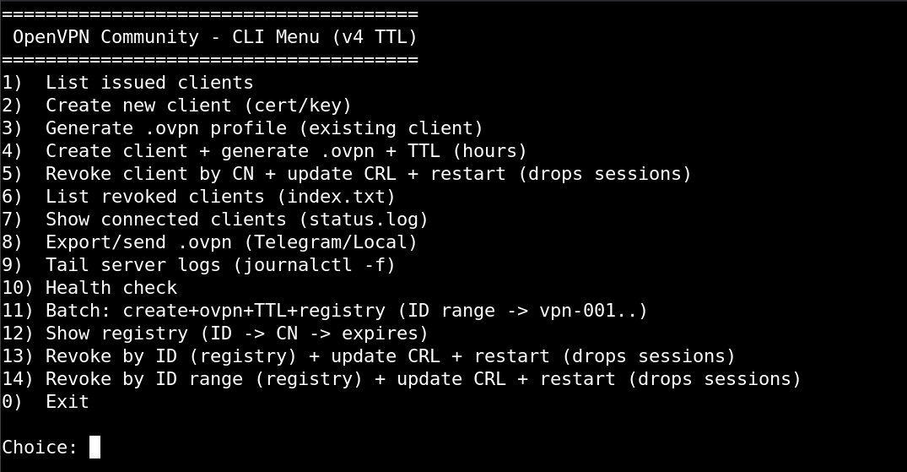
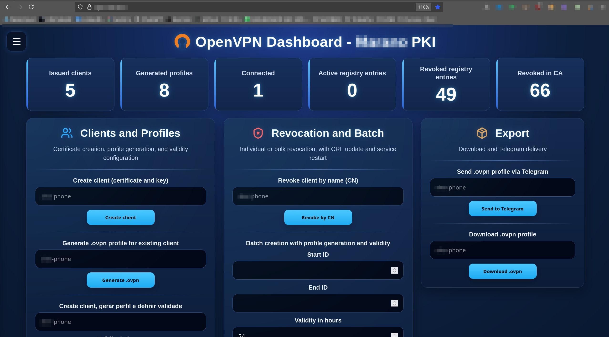
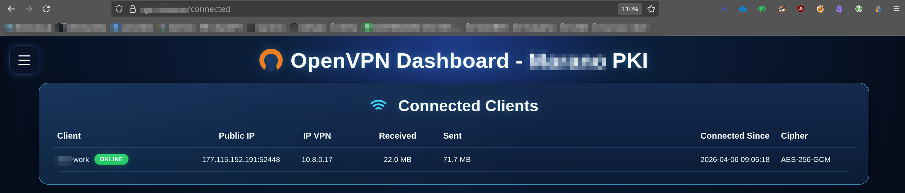
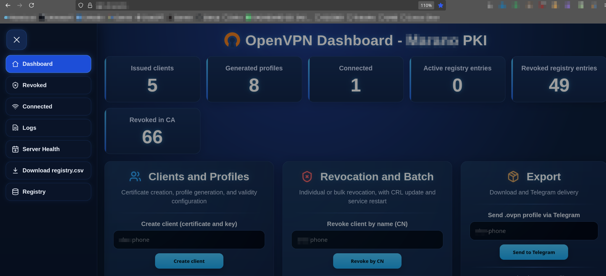
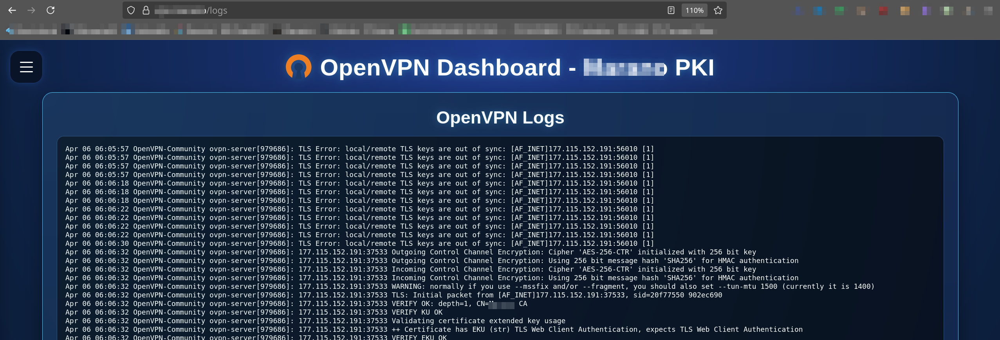

# 🛡️ OpenVPN Self-Hosted Platform with Proxmox + LXC + CLI + Web Panel + Telegram Integration

<p align="center">
  
</p>

<p align="center">
  <b>Fully self-hosted OpenVPN platform with Web UI, CLI automation and no user limits</b>
</p>

---

## 🚀 Badges

<p align="center">


</p>

---

# 📌 Overview

This project delivers a **fully self-hosted OpenVPN platform** designed for:

* homelabs
* cyber training environments
* internal infrastructure
* controlled enterprise scenarios

It combines:

* OpenVPN Community Edition
* Easy-RSA PKI
* CLI automation (full lifecycle management)
* Web dashboard (Flask-based UI)
* Telegram integration for `.ovpn` delivery

👉 **No artificial connection limits. No vendor lock-in. Full control.**

</div>

> [!IMPORTANT]
> The script may have execution errors, translation issues, and opportunities for visual improvements. Contribute!

<div align="center">

  
---

# 🎯 Why this project exists

Most self-hosted VPN solutions:

* limit concurrent users
* hide internal PKI
* restrict automation

This project solves that by providing:

* full PKI ownership
* certificate lifecycle control
* unlimited simultaneous connections
* operational simplicity (CLI + Web)
* automation-ready design

👉 **Built for real-world operators, not just lab demos.**

---

# 🧭 Deployment Flow

```text
1. Install OpenVPN
2. Configure PKI (Easy-RSA)
3. Start VPN server
4. (Optional) Use CLI automation
5. Deploy Web Panel
6. (Optional) Add Nginx reverse proxy
```

---

# 🌐 Real-world scenario (Important)

This project was implemented in a **home/lab environment**:

* No public static IP
* DDNS used
* Router performing NAT + port forwarding

```text
Internet
   |
[ ISP Router ]
  - DDNS → yourdomain.ddns.net
  - UDP 1194 → forwarded
   |
[ Proxmox Host ]
   |
[ OpenVPN LXC Container ]
  - eth0 → LAN
  - tun0 → VPN
```

⚠️ Adapt for:

* cloud environments
* static IP setups
* enterprise firewalls

---

# 📸 Screenshots

### CLI



### Dashboard



### Connected Clients



### Sidebar



### Logs



---

# 🧪 Tested Environment

* Proxmox VE
* Ubuntu 22 LXC
* OpenVPN Community
* Easy-RSA
* Python 3 + Flask
* Nginx
* iptables

---

# 📦 Base Installation (OpenVPN)

## Install packages

```bash
apt update
apt install -y openvpn easy-rsa iptables-persistent python3 python3-pip nginx curl
```

---

# 🔐 PKI Setup (Easy-RSA)

```bash
make-cadir /etc/openvpn/easy-rsa
cd /etc/openvpn/easy-rsa

./easyrsa init-pki
./easyrsa build-ca nopass

./easyrsa gen-req server nopass
./easyrsa sign-req server server
./easyrsa gen-dh

openvpn --genkey tls-crypt /etc/openvpn/tc.key

./easyrsa gen-crl
cp pki/crl.pem /etc/openvpn/
chmod 644 /etc/openvpn/crl.pem
```

---

# ⚙️ OpenVPN Server

```text
/etc/openvpn/server.conf
```

---

# 🔁 NAT & Forwarding

```bash
sysctl -w net.ipv4.ip_forward=1

iptables -t nat -A POSTROUTING -s 10.8.0.0/24 -o eth0 -j MASQUERADE
netfilter-persistent save
```

---

# ▶️ Start Service

```bash
systemctl enable openvpn@server
systemctl start openvpn@server
```

---

# 💻 CLI Management

Script:

```text
scripts/ovpn-menu.sh
```

## Capabilities

* client creation
* `.ovpn` generation
* revoke (CN / ID / range)
* TTL-based registry
* Telegram export
* logs + health checks

---

# 🌐 Web Panel

## Features

* Dashboard
* Connected clients
* Client management
* Revocation
* Logs
* Health check
* Telegram integration
* Sidebar UI

---

# ⚡ Quick Start (Web Panel)

## Clone repository

```bash
git clone https://github.com/r0s3mbr1ck/OVPN_Self_Hosted.git
cd OVPN_Self_Hosted
```

---

## Setup environment

```bash
python3 -m venv venv
source venv/bin/activate
pip install -r requirements.txt
```

---

## Configure variables

```bash
nano /root/.config/ovpn-menu.env
```

```bash
export OVPN_WEB_SECRET='CHANGE_ME'
export OVPN_TG_BOT_TOKEN='CHANGE_ME'
export OVPN_TG_CHAT_ID='CHANGE_ME'
```

---

## Run

```bash
python3 app.py
```

Access:

```text
http://127.0.0.1:8080
```

---

# 🌍 Nginx Reverse Proxy

```nginx
server {
    listen 80;
    server_name vpn.yourdomain.local;

    location / {
        proxy_pass http://127.0.0.1:8080;
        proxy_set_header Host $host;
        proxy_set_header X-Real-IP $remote_addr;
    }
}
```

---

## Redirect IP → Domain

```nginx
server {
    listen 80;
    server_name 192.168.XX.XX;
    return 301 http://vpn.yourdomain.local$request_uri;
}
```

---

# 📁 Project Structure

```text
.
├── README.md
├── app.py
├── requirements.txt
├── templates/
├── static/
├── scripts/
│   └── ovpn-menu.sh
├── docs/images/
├── examples/
└── venv/
```

---

# 📁 Example Files

```text
examples/
├── server.conf.example
├── base.conf.example
├── ovpn-web-service.service.example
├── ovpn-menu.env.example
```

---

# 🔐 Security Notes

* Use HTTPS if exposed externally
* Restrict access to the panel
* One certificate per device
* Revoke compromised devices immediately
* Never publish `.ovpn` files or private keys

---

# 🧠 Final Notes

This project provides:

* a complete self-hosted VPN stack
* automation + UI
* scalability without licensing limits

👉 Ideal for labs, training environments, and internal infrastructure.

---

# 🚀 Next Step

👉 Docker version (1-command deployment)
