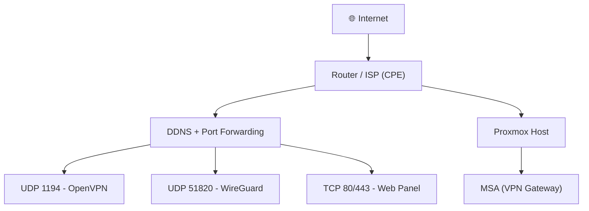

<div align="center">
  <h1>
    
    Marano Secure Access (MSA)
  </h1>
</div>

<p align="center">
  
</p>

<p align="center">
  <b>Self-hosted secure access platform with OpenVPN, WireGuard, MFA and full lifecycle control</b>
</p>

<p align="center">
  
  
  
  
</p>

<div align="center">
  <h2>👊 No vendors. No limits. <b>Full control.</b></h2>
</div>

---

## ⚡ Highlights

- 🔐 MFA (2FA) for administrative access  
- 🌐 OpenVPN + WireGuard support  
- 🧠 Registry-based lifecycle management  
- 📦 Profile delivery (Download / Email / Telegram)  
- 🚫 No user limits  
- 🧩 Full PKI ownership  

---

## 🧠 What is MSA?

**Marano Secure Access (MSA)** is a self-hosted platform for **identity-driven VPN access management**.

It combines:

- VPN provisioning (OpenVPN / WireGuard)
- User identity (email-based)
- Access lifecycle control
- Secure profile delivery

MSA transforms VPN access from a manual process into a **controlled, auditable and automated system**.

👉 Built for homelabs, cyber training platforms and internal infrastructure.

---

## 🎬 Features

### 🔐 MFA Login


### 🌐 Modern UI


### 📲 Mobile-friendly
<p align="center">
  
</p>

### 👤 VPN Profile Creation


---

## 🧱 Architecture (Overview)

- OpenVPN / WireGuard (Access Layer)  
- Identity via Email + SQLite  
- MFA for admin access  
- Web-based lifecycle management  
- Profile delivery (Email / Telegram / Download)  

---

## 🔐 PKI Requirement

MSA relies on a valid PKI (Public Key Infrastructure) using Easy-RSA.

The automated setup will initialize:

- Certificate Authority (CA)
- Server certificate
- Certificate Revocation List (CRL)

---

## 🌍 Deployment Example



---

## 📦 Installation

### ⚡ Option 1 — Automated Setup (Recommended)

Run the bootstrap script to fully configure the environment:

```
chmod +x bootstrap.sh
./bootstrap.sh
```

This will automatically:

- Install dependencies
- Fix Easy-RSA path
- Initialize PKI (CA, server cert, CRL)
- Configure admin credentials and MFA
- Prepare the application environment


After completion:
```
cd Marano_Secure_Access_MSA
source venv/bin/activate
python3 app.py
```

Access:
```
http://<SERVER_IP>:8080
```

---

### 🛠️ Option 2 — Manual Setup

#### Install dependencies
```
apt update
apt install -y python3 python3-pip python3.13-venv easy-rsa nginx git
```
#### Clone repository
```
git clone https://github.com/r0s3mbr1ck/Marano_Secure_Access_MSA.git
cd Marano_Secure_Access_MSA
```

#### Python environment
```
python3 -m venv venv
source venv/bin/activate
pip install -r requirements.txt
```

#### 🔧 Easy-RSA Fix (Debian)
```
mkdir -p /etc/openvpn
ln -s /usr/share/easy-rsa /etc/openvpn/easy-rsa
```

#### 🔐 Initial Setup (Admin + MFA)
```
python3 setup_admin.py
```

#### ▶️ Run the application
```
python3 app.py
```

---

## 🧠 First Access Flow

1. Run bootstrap or manual setup

2. Configure admin credentials and MFA

3. Start the application

4. Login to admin panel

5. Create VPN profiles

6. Deliver access to users


---

## 🌐 Access

Local:
```
http://127.0.0.1:8080
```

Network:
```
http://<SERVER_IP>:8080
```

---

## 📱 MFA Login

Use a TOTP app:

- Google Authenticator
- Microsoft Authenticator
- Authy
- Other Authenticator App


Scan the QR code or use the generated secret.


---

## ⚠️ Additional Configuration Required

This project does not include automatic setup of:

- Network routing (TUN / NAT)
- Firewall rules
- Port forwarding / NAT on router
- Reverse proxy (optional)

Proper VPN functionality depends on correct network configuration.


---

## 📚 Documentation
Detailed guides and internal design:  
  
🔐 [`PKI & OpenVPN Setup`](docs/pki_and_openvpn_setup.md)  
  
🧠 [`Architecture`](docs/architecture.md)  
  
🔒 [`Security Model`](docs/security_model.md)  
  
📡 [`Deployment Guide`](docs/deployment.md)  
  
🗂️ [`Registry System`](docs/registry.md)  
  
👤 [`User & Access Flow`](docs/user_flow.md)  

---

## 📁 Project Structure
```text
Marano_Secure_Access_MSA/
├── app.py
├── setup_admin.py
├── bootstrap.sh
├── requirements.txt
├── .gitignore
├── .env.example
├── templates/
│   ├── base.html
│   ├── index.html
│   ├── login.html
│   ├── user_login.html
│   ├── user_dashboard.html
│   ├── user_request_access.html
│   ├── user_change_password.html
│   ├── change_password.html
│   ├── create_vpn_profile.html
│   ├── create_wireguard_profile.html
│   ├── create_auth_profile.html
│   ├── batch_auth_profiles.html
│   ├── batch_auth_profiles_csv.html
│   ├── revoke_access.html
│   ├── revoked.html
│   ├── connected.html
│   ├── logs.html
│   ├── registry.html
│   ├── registry_export.html
│   └── health.html
├── static/
│   └── css/
│       └── style.css
├── docs/
│   ├── images/
│   ├── pki_and_openvpn_setup.md
│   ├── architecture.md
│   ├── security_model.md
│   ├── deployment.md
│   ├── registry.md
│   └── user_flow.md
├── examples/
├── registry/        # ignored by git
├── data/            # ignored by git
└── pki/             # ignored by git
```


---

## 🚀 Roadmap

- [x] WireGuard QR Code support
- [ ] Registry → SQLite migration
- [ ] REST API (automation & integration)
- [ ] RBAC / multi-user roles
- [ ] Zero Trust policy enforcement


---

## ⚠️ Notes

🚩 Designed for self-hosted environments

🚩 Requires networking and PKI knowledge

🚩 Do not expose private keys or sensitive data

---
