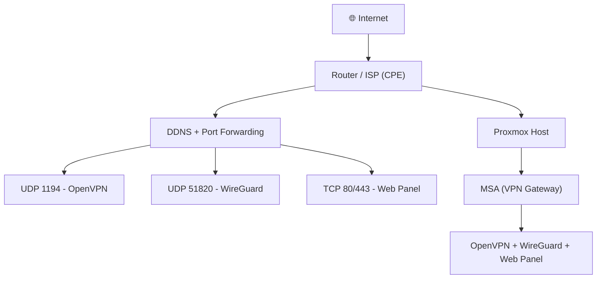

<div align="center">
  <h1>
    
    Marano Secure Access (MSA)
  </h1>
</div>

<p align="center">
  
</p>

<p align="center">
  <b>Self-hosted secure access platform with OpenVPN, WireGuard, MFA and full lifecycle control</b>
</p>

<div align="center">
  <h1>
   👊 No vendors. No limits. You in control!
  </h1>
</div>

## ⚡ Highlights

- 🔐 MFA (2FA) for administrative access  
- 🌐 OpenVPN + WireGuard support  
- 🧠 Registry-based lifecycle management  
- 📦 Profile delivery (Download / Email / Telegram)  
- ⚙️ Web automation  
- 🚫 No user limits  
- 🧩 Full PKI ownership  

---

## 🧠 What is MSA?

**Marano Secure Access (MSA)** is a **self-hosted secure access platform** designed to manage VPN access with full control over identity, lifecycle, and distribution.

It goes beyond a simple VPN installer by providing:

- identity-aware access  
- certificate lifecycle management  
- hybrid authentication (certificate + credentials)  
- centralized registry tracking  
- operational visibility  
- automation-ready workflows  

### 👉 Built for real-world environments such as homelabs, cyber training platforms, and internal infrastructure.


---

## 🎬 Features

### 🔐 MFA Login


### 🌐 Modern UI Webpage


## 📲 Mobile-friendly


### 👤 Profile VPN creation


### ✅ Bulk VPN profile creation 


### 📨 Export to Telegram or email


### 🔁 Revoke / Remove Peer


---

## 🧱 Architecture

MSA is structured in four layers:

### 🔹 Access Layer
- OpenVPN  
- WireGuard  

### 🔹 Identity Layer
- Easy-RSA PKI  
- Optional credential-based authentication  
- MFA (TOTP)  

### 🔹 Management Layer
- Flask Web Dashboard  
- Registry engine  

### 🔹 Delivery Layer
- Profile download  
- Email delivery  
- Telegram delivery  

---

## 📦 Installation

### 1. Install dependencies

```bash
apt update
apt install -y openvpn easy-rsa wireguard iptables-persistent python3 python3-pip nginx
```

---

2. Clone project
```bash
git clone https://github.com/YOUR_USER/msa.git
cd msa
```

---

3. Setup environment
```bash
python3 -m venv venv
source venv/bin/activate
pip install -r requirements.txt
```

---

4. Configure environment
```bash
nano /root/.config/msa.env
```

Example:
```bash
MSA_WEB_SECRET=CHANGE_ME

MSA_ADMIN_USER=admin
MSA_ADMIN_PASS=CHANGE_ME
MSA_ADMIN_TOTP_SECRET=CHANGE_ME

MSA_TG_BOT_TOKEN=CHANGE_ME
MSA_TG_CHAT_ID=CHANGE_ME

MSA_SMTP_HOST=smtp.example.com
MSA_SMTP_PORT=465
MSA_SMTP_USER=CHANGE_ME
MSA_SMTP_PASS=CHANGE_ME
MSA_SMTP_FROM=CHANGE_ME
```

---

5. Run
```bash
python3 app.py
```
Access:

http://127.0.0.1:8080


---

## 🌍 Deployment (Real-world Example)

Typical home/lab setup:



> [!tip]
> - If you don’t have a public static IP, use DDNS.
> 
> - If ports 80/443 are blocked: use a high port (e.g. 8443) and remember of redirect ports
> 
> - Generate app password from mail account and one token of telegram bot to configure .env
> 
> - Always validate: curl ifconfig.me
> 
> - If behind CGNAT: VPN access from outside will not work without workaround (e.g. VPS relay)

---

## 🔐 Authentication Modes

MSA supports:
- Certificate only (OpenVPN)
- Certificate + Credentials + Send temporary password + Reset (Resend)
- WireGuard peer-based access
- MFA for admin login


---

## 🗂️ Registry System
MSA includes a registry engine that tracks:
- active clients
- revoked clients
- profile types
- lifecycle state


## Supported operations:
- auto-registration on creation
- revoke tracking
- rebuild from system state
- export

---

## 🌐 Web Panel

Features:
- Dashboard
- Issued clients
- Connected clients
- Profile creation individual or groups
- Revoke / Remove peer individual or groups
- Logs
- Server health
- Registry management

---

## 🔐 Security Notes

- Use HTTPS in production (recommended: Nginx reverse proxy)
- Restrict access to the web panel (firewall or VPN-only access)
- Always enable MFA
- Use one profile per device
- Revoke compromised clients immediately
- Never expose private keys or .ovpn files

---

## 📁 Project Structure
```text
Marano_Secure_Access_MSA/
├── app.py
├── requirements.txt
├── templates/
│   └── index.html
├── static/
│   └── css/
│       └── style.css
├── docs/
│   └── images/
└── examples/
```

---

## 🚀 Roadmap

### Short Term
- UI improvements
- safer bulk operations
- registry enhancements
- improved health dashboard


### Mid Term
- audit logs
- RBAC (roles)
- better filtering/search
- backup/restore

### Future
- REST API
- multi-admin support
- zero-trust model
- enterprise integration

---

## 🤝 Contributing

Contributions are welcome.

Focus areas:
- security
- UI/UX
- automation
- documentation

---

## 📌 Final Notes
MSA provides:
- full control
- self-hosted architecture
- OpenVPN + WireGuard
- MFA protection
- lifecycle management


## 👉 Ideal for labs, cyber environments, and controlled access infrastructures.

---
