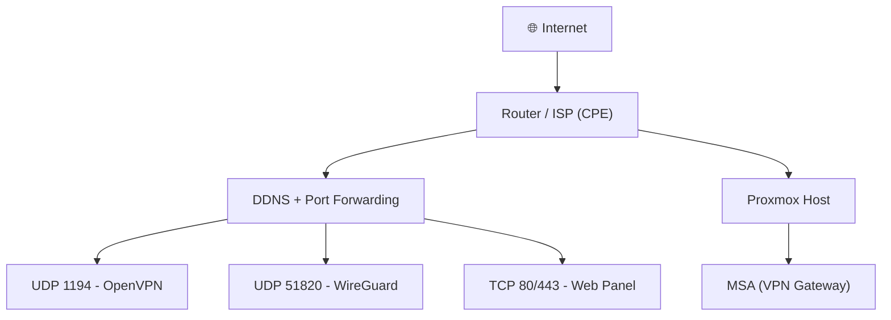

<div align="center">
  <h1>
    
    Marano Secure Access (MSA)
  </h1>
</div>

<p align="center">
  
</p>

<p align="center">
  <b>Self-hosted secure access platform with OpenVPN, WireGuard, MFA and full lifecycle control</b>
</p>

<div align="center">
  <h2>👊 No vendors. No limits. You in control!</h2>
</div>

---

## ⚡ Highlights

- 🔐 MFA (2FA) for administrative access  
- 🌐 OpenVPN + WireGuard support  
- 🧠 Registry-based lifecycle management  
- 📦 Profile delivery (Download / Email / Telegram)  
- 🚫 No user limits  
- 🧩 Full PKI ownership  

---

## 🧠 What is MSA?

**Marano Secure Access (MSA)** is a self-hosted platform designed to manage VPN access with full control over identity, lifecycle, and distribution.

Built for homelabs, cyber training environments and internal infrastructure.

---

## 🎬 Features

### 🔐 MFA Login


### 🌐 Modern UI


### 📲 Mobile-friendly
<p align="center">
  
</p>

### 👤 VPN Profile Creation


---

## 🧱 Architecture (Overview)

- OpenVPN / WireGuard (Access Layer)  
- Identity via Email + SQLite  
- MFA for admin access  
- Web-based lifecycle management  
- Profile delivery (Email / Telegram / Download)  

---

## 🌍 Deployment Example



---

## 📦 Installation (Quick Start)
```bash
apt update
apt install -y python3 python3-pip nginx
```

```bash
git clone https://github.com/YOUR_USER/Marano_Secure_Access_MSA.git
cd Marano_Secure_Access_MSA
```

```bash
python3 -m venv venv
source venv/bin/activate
pip install -r requirements.txt
```

```bash
python3 app.py
```

Access:

http://127.0.0.1:8080


---

## ⚠️ Additional Configuration Required

This project does not include automatic setup of:

- OpenVPN server
- PKI / certificates
- Network routing (TUN / NAT)

---

## 📚 Documentation

### Detailed guides and internal design:

🔐 [`PKI & OpenVPN Setup`](docs/pki_and_openvpn_setup.md)

🧠 [`Architecture`](docs/architecture.md)

🔒 [`Security Model`](docs/security_model.md)

📡 [`Deployment Guide`](docs/deployment.md)

🗂️ [`Registry System`](docs/registry.md)

👤 [`User & Access Flow`](docs/user_flow.md)

---

## 📁 Project Structure
```text
Marano_Secure_Access_MSA/
├── app.py
├── requirements.txt
├── .gitignore
├── .env.example
├── templates/
│   ├── base.html
│   ├── index.html
│   ├── login.html
│   ├── user_login.html
│   ├── user_dashboard.html
│   ├── user_request_access.html
│   ├── user_change_password.html
│   ├── change_password.html
│   ├── create_vpn_profile.html
│   ├── create_wireguard_profile.html
│   ├── create_auth_profile.html
│   ├── batch_auth_profiles.html
│   ├── batch_auth_profiles_csv.html
│   ├── revoke_access.html
│   ├── revoked.html
│   ├── connected.html
│   ├── logs.html
│   ├── registry.html
│   ├── registry_export.html
│   └── health.html
├── static/
│   └── css/
│       └── style.css
├── docs/
│   ├── images/
│   ├── pki_and_openvpn_setup.md
│   ├── architecture.md
│   ├── security_model.md
│   ├── deployment.md
│   ├── registry.md
│   └── user_flow.md
├── examples/
├── registry/        # ignored by git
├── data/            # ignored by git
└── pki/             # ignored by git
```

---

## 🚀 Roadmap

⬆️ QR Code for WireGuard

⬆️ Registry → SQLite migration

⬆️ API support

⬆️ RBAC / multi-user roles

⬆️ Zero Trust policies


---

## ⚠️ Notes
🚩 Designed for self-hosted environments

🚩 Requires networking and PKI knowledge

🚩 Do not expose private keys or sensitive data

